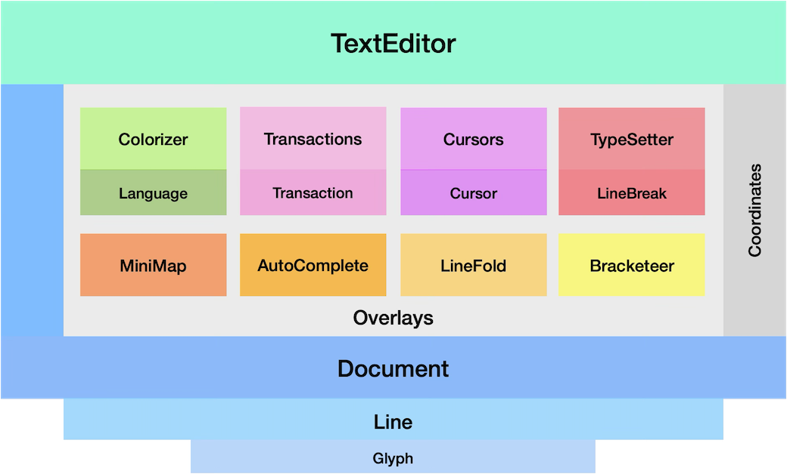
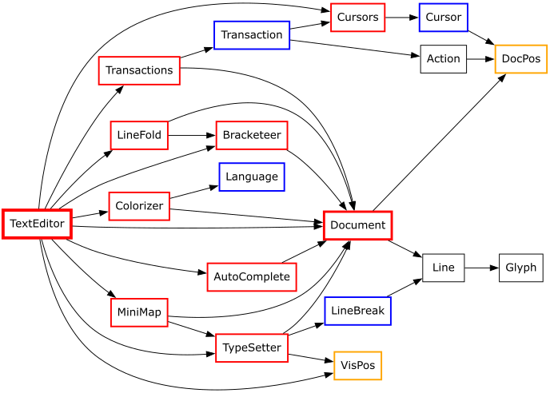

# Architecture

While this editor relies on [Omar Cornut's Dear ImGui](https://github.com/ocornut/imgui),
it does not follow the "pure" one widget - one function approach. Since the editor
has to maintain a relatively complex and large internal state, it did not seem
practical to try and enforce full immediate mode. It therefore stores its internal state
in an object instance which is reused across frames. This object is an instance of the
TextEditor class which not only stores the internal state, it also provides the public API.
The "Render" member functions however works like a normal Dear ImGui widget. It creates a
child window to render the editor so you can call Dear ImGui window functions like
SetNextWindowSize or set the font before calling Render.

The block diagram below shows the architecture of this widget. At the top is
the public facing TextEditor instance and at the bottom are the private classes
that store and maintain the internal state.

### Document

This class, as the name suggests, stores the document that's being edited.
Internally, a Document is a std::vector of Lines that themselves are
std::vectors of Glyphs.

The Document class translates from the external UTF-8 encoding to the internal
codepoints and provides a number of member functions to manipulate content,
calculate coordinates, assist searches and track overall state.

The Line and Glyph classes are used to represent the document's structure with
Glyph just holding a codepoint, a color and a possible text breaking status.
Both Line and Glyph also hold information used by overlays discussed below.

### Overlays

Overlays are addons to a document that handle additional functionality or state.
In some cases, overlays store there information in the Line/Glyph objects and
the overlays are responsible for keeping the state consistent. Other overlays
of the TextEditor class can use this extra information for their purposes.

#### Colorizer

The colorizer maintains the color state of each glyph based on the rules
provided by the Language specification object. The original version
used regular expressions for some languages but this was/is not very
performant. The new colorizer is based on multiple state-transition engines
that make it easier to express language rules and also improves performance.
The new colorizer only effects lines that have changed but keep in mind, that
for instance opening a multiline comment at the start of the document,
causes the entire document to be re-colored. Luckily the new engine is fast
enough that you don't notice this and it would only affect a single frame. I
think it is also important to point out that this widget is not really intended
for mega/gigabyte size text files. For those, I would still use a regular text
editors (if you can find one that can handle that requirement).

#### Transactions

This class contains a list of Transaction records to support do/undo/redo
operations. Each Transaction record contains insert and delete Actions
performed on a document.

#### Cursors

The Cursors class maintains a list of Cursor instances and operates very much
like cursors do in Visual Studio Code. The list of cursors consists of the
main cursor (which is always present) and a optional set of additional cursors.
The last cursor added is considered the current cursor which has meaning for
some actions or API calls.

#### TypeSetter

This class handles the visualization of a document and maintains the link
between the logical state off a document and it's visual representation.
In some cases, these are the same but tabs cause horizontal offsets and
word wrap as well as line folding cause vertical offsets. To support this,
the editor has two coordinate systems. DocPos is used as the logical address
of a glyph in a document. It is expressed as a line number with a glyph index.
This is the dominant coordinate system in the editor and it is also used in most
API calls. VisPos is the other coordinate system and it addresses the visual
location of a glyph on the screen expressed as a row and a column. No public
APIs use this second coordinate system but it is publicly exposed as are the
translation function to and from DocPos. So if required, applications can
also use it.

#### Minimap

This class keeps the state of the optional minimap.

#### AutoComplete

This class keeps track of autocomplete activities when the feature is configured.
Once autocomplete is triggered, this class tracks the state, interacts with the
user and uses an external callback to collect suggestions in the current context
(see [details here](autocomplete.md)).

#### LineFold

This class contains the algorithms for word wrap and it is used by the TypeSetter
when this feature is activated. More details about the available algorithms and how
to configure them, can be found [here](wordwrap.md).

#### Bracketeer

This class keeps track of where bracket pairs (parenthesis, square brackets and
curly brackets) are in the document so they can be highlighted, colorized and
selected when this feature is activated. It will also colorize unbalanced brackets
as errors. Brackets in comments and strings are ignored.

#### TextEditor

As mentioned above, the TextEditor class provides the public API. As is true
for Dear ImGui and the original text editor, all public member functions start
with an uppercase letter. Internally, all private member functions and variables
start with a lowercase letter so it's easy to see what's public and what's private.

In addition to being the public interface, the TextEditor class is also responsible
for synchronizing the state of the lower levels of the architecture. When for
instance the user pastes some text, TextEditor ensures that the Document gets
updated, Cursors get adjusted (if required), Transaction records are created (so
this paste operation can be undone and redone) and the overlays are informed of
the changes so they can update their state.

The final responsibility of the TextEditor class is overall rendering and
user input (keyboard and mouse) processing.

Below is a dependency graph for the major internal classes of the TextEditor.

