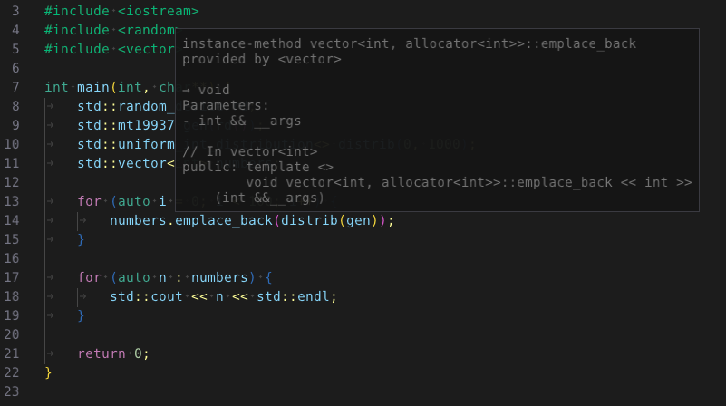

# Hover Popup

The text editor provides a mechanism to show popup help over the cursor. This feature is (de)activated by setting
or resetting a callback. You can see this feature in action in the example application where it is used to show
context specific help retrieved from a language server.

```c++
	// set the callback and activate hover based help
	editor.SetTextHoverCallback([&](TextEditor::PopupData) {
		ImGui::TextDisabled("Some Important Message");
	});

	...
	// turn it back off
	editor.SetTextHoverCallback(nullptr);
```


